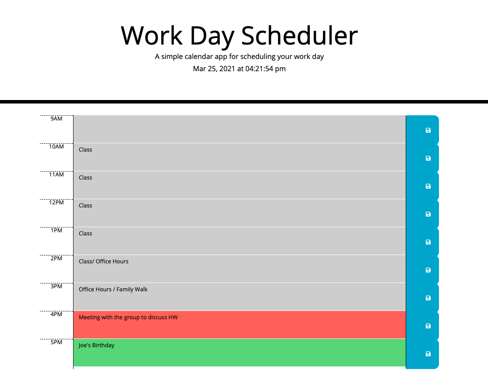

# Work Scheduler
-- Unit 5 Homework 1 -- Zack Campbell

## Description

Using javascript and third party APIs like jquery and momentjs, we added functionality to a daily planner. We needed to store the values entered in each hour locally so they would persist if the user came back later, and display the current date. We also had to format the the hour blocks to display a color depending on whether they are in the past, present, or future.

## Installation

Another pretty basic webpage, so nothing to install. The repository is public to feel free to grab any of the files or take a look at the finished product [here.](https://zax5021.github.io/work-day-scheduler/)

## Screenshots

## License
[MIT](https://choosealicense.com/licenses/mit/)